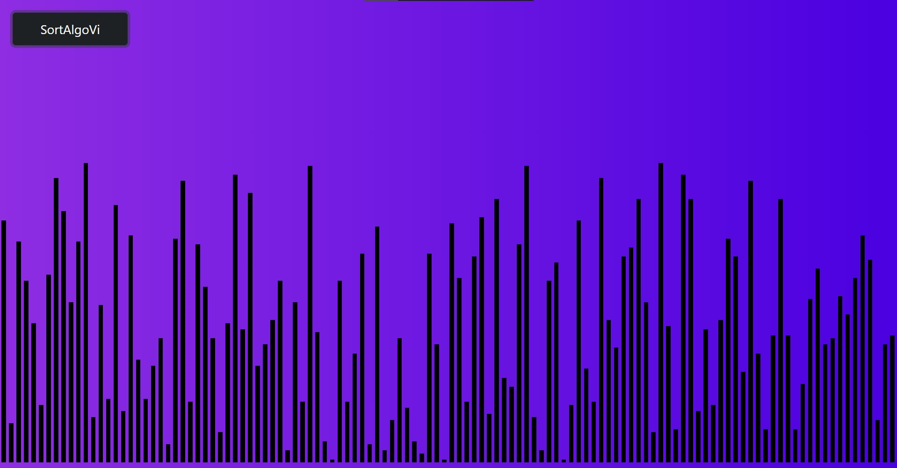
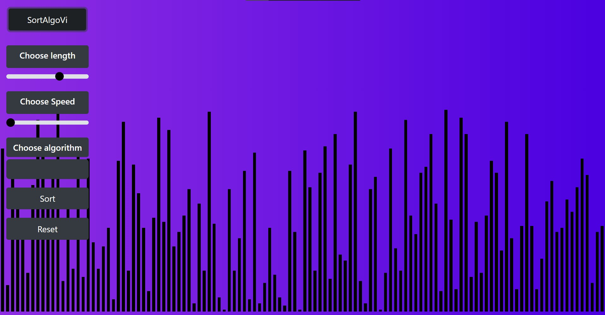

# SortAlgoVi - Sorting Algorithm Visualizer

SortAlgoVi is a web-based sorting algorithm visualizer that allows users to visualize how various sorting algorithms work in real-time. The application is built using Vue.js and Bootstrap, and it provides a user-friendly interface for selecting different sorting algorithms, adjusting array length and sorting speed, and visualizing the sorting process.

## Features

- Choose the length of the array to be sorted using a range slider
- Choose the sorting speed using another range slider
- Select from different sorting algorithms, including Bubble Sort, Selection Sort, and Quick Sort
- Start and stop the sorting process with a "Sort" and "Reset" button
- Visualize the sorting process in real-time with colorful bars representing the array elements
- Responsive design with a fixed position header and a collapsible sidebar

## Installation

1. Clone the repository or download the source code as a ZIP file.
2. Navigate to the project directory in the terminal.
3. Install the dependencies using the following command:

```sh
npm install
```
4. Run the application locally with hot-reloading using the following command:

```sh
npm run serve
```

5. Open your web browser and go to http://localhost:8080 to see the SortAlgoVi application running.


##Usage

Choose the length of the array by dragging the "Choose length" range slider.
Choose the sorting speed by dragging the "Choose speed" range slider.
Select a sorting algorithm from the "Choose algorithm" dropdown menu.
Click the "Sort" button to start the sorting process.
Watch the bars representing the array elements move and change color as the sorting algorithm progresses.
Click the "Reset" button to stop the sorting process and reset the array.
Contributing
If you want to contribute to SortAlgoVi, feel free to submit pull requests or open issues on the GitHub repository. Any contributions, feedback, or suggestions are welcome!

##License

SortAlgoVi is open source and available under the MIT License.

##Credits

Vue.js - JavaScript framework for building user interfaces
Bootstrap - Front-end framework for developing responsive web pages
GitHub - Version control and code hosting platform
Vue-Bootstrap - Vue.js implementation of Bootstrap components
Vue-Select - Customizable select box component for Vue.js
Vue-Range-Slider - Range slider component for Vue.js
Vue-Transition-Expand - Vue.js transition component for expanding and collapsing elements

## UI Appearance




